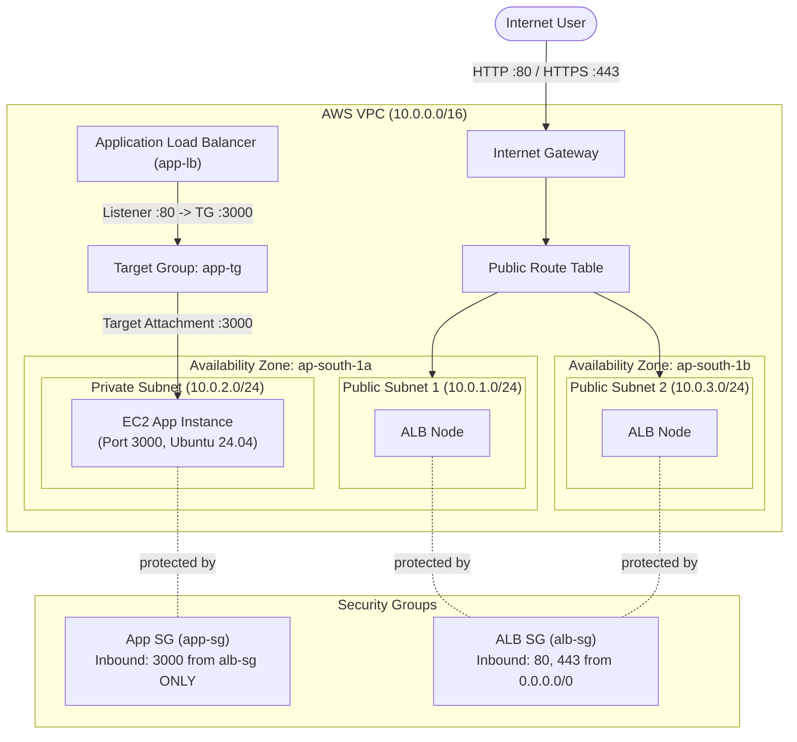

# 02 - VPC with Private App Instance & Public Application Load Balancer (ALB)

This Terraform project provisions a secure 2-tier network architecture on AWS in `ap-south-1` (Mumbai region). It places a public-facing Application Load Balancer in public subnets across two Availability Zones and hosts the web application EC2 instance securely inside a private subnet.

---

## 🏛️ Architecture Overview



---

## 🧩 Components Breakdown

| Resource Name | Type | CIDR / Config | Description |
| :--- | :--- | :--- | :--- |
| `aws_vpc.main` | VPC | `10.0.0.0/16` | Main virtual private cloud |
| `aws_subnet.public1` | Public Subnet | `10.0.1.0/24` (`ap-south-1a`) | Primary public subnet for ALB |
| `aws_subnet.public2` | Public Subnet | `10.0.3.0/24` (`ap-south-1b`) | Secondary public subnet (required for multi-AZ ALB) |
| `aws_subnet.private` | Private Subnet | `10.0.2.0/24` (`ap-south-1a`) | Isolated private subnet for backend application |
| `aws_internet_gateway.gw` | Internet Gateway | N/A | Enables public Internet access for the public subnets |
| `aws_route_table.public` | Route Table | `0.0.0.0/0` -> IGW | Routes public subnet traffic out to Internet |
| `aws_security_group.alb` | Security Group | Ports 80, 443 | Accepts public web traffic from anywhere (`0.0.0.0/0`) |
| `aws_security_group.app` | Security Group | Port 3000 | Restricts ingress **only** from `alb-sg` (Security Group chaining) |
| `aws_lb.main` | Application Load Balancer | Internet-facing | Distributes traffic across public subnets |
| `aws_lb_target_group.app` | Target Group | Port 3000 (HTTP) | Routes requests to backend EC2 instance |
| `aws_lb_listener.web` | ALB Listener | Port 80 (HTTP) | Forwards incoming HTTP requests to target group |
| `aws_instance.app` | EC2 Instance | Ubuntu 24.04 (`t3.micro`) | Application instance provisioned inside private subnet |

---

## 🔒 Security Best Practices Implemented

1. **Security Group Chaining**: The backend EC2 instance (`app-sg`) does **not** accept direct traffic from `0.0.0.0/0`. It only accepts traffic on port 3000 originating specifically from the Load Balancer's security group (`alb-sg`).
2. **Private Network Isolation**: The application EC2 instance is deployed inside a private subnet (`10.0.2.0/24`) without a public IP address.
3. **Multi-AZ ALB Resilience**: The Application Load Balancer spans across two Availability Zones (`ap-south-1a` and `ap-south-1b`), satisfying AWS requirements for high availability load balancing.

---

## 🚀 How to Run

### Prerequisites
- AWS CLI configured with valid credentials (`aws configure`).
- Terraform CLI installed (`>= 1.0`).

### Step 1: Initialize Terraform
Navigate to this directory and initialize provider plugins:
```bash
cd 02-vpc-private-app-public-alb
terraform init
```

### Step 2: Format & Validate Code
```bash
terraform fmt
terraform validate
```

### Step 3: Review Execution Plan
```bash
terraform plan
```

### Step 4: Apply Configuration
```bash
terraform apply
```

### Step 5: Clean Up (Destroy Infrastructure)
To avoid AWS charges when done:
```bash
terraform destroy
```
