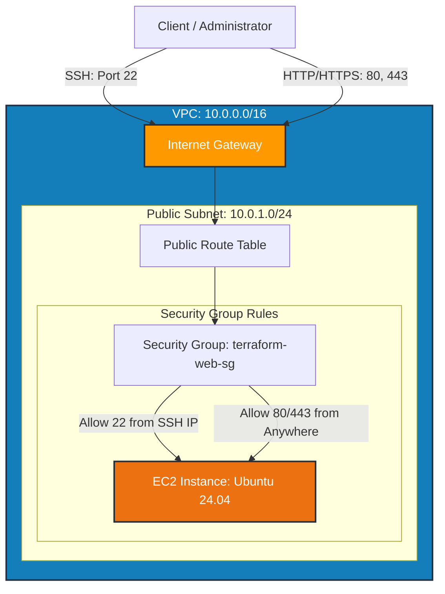
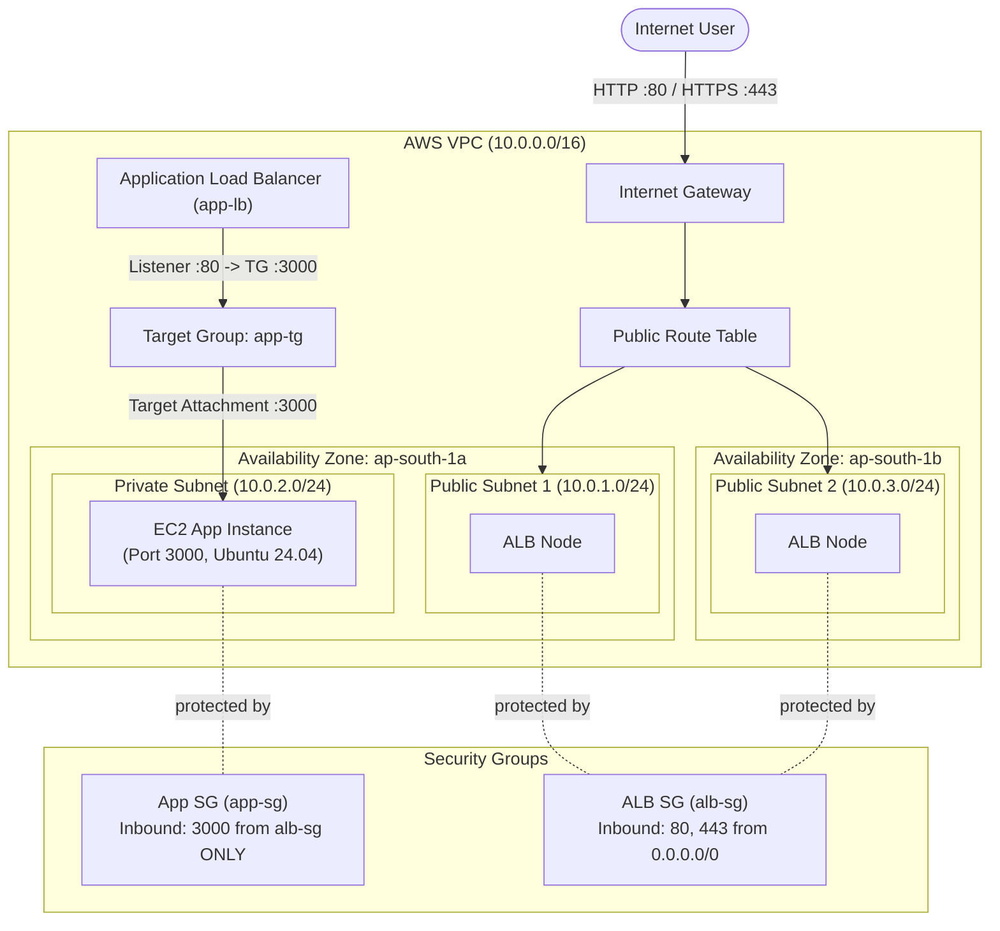

# 🚀 Terraform AWS Architecture Series

Welcome to the **Terraform AWS Architecture Series** repository! This repository is structured as a progressive hands-on laboratory for designing, provisioning, and scaling production-ready AWS cloud infrastructure using Infrastructure as Code (IaC) with Terraform.

Each directory in this repository represents an independent, self-contained architecture pattern.

---

## 🗺️ Repository Architecture Roadmap

```
terraform-aws-architecture-series/
│
├── 📁 01-vpc-ec2-web-server              <-- Custom VPC with EC2 Web Server
├── 📁 02-vpc-private-app-public-alb      <-- Public ALB with Private App EC2 Instance
├── 📁 03-three-tier-web-application      (Upcoming)
├── 📁 04-alb-auto-scaling                (Upcoming)
├── 📁 05-rds-high-availability           (Upcoming)
├── 📁 06-nat-gateway-private-ec2         (Upcoming)
├── 📁 07-ecs-containerized-application   (Upcoming)
├── 📁 08-serverless-web-application      (Upcoming)
└── 📁 09-production-ready-architecture   (Upcoming)
```

---

## 📐 Architecture 01: Custom VPC with EC2 Web Server

> **Directory**: [`./01-vpc-ec2-web-server`](./01-vpc-ec2-web-server)

### System Design Diagram

```
+-----------------------------------------------------------------------------------+
|                                     AWS Cloud                                     |
|                                                                                   |
|  +-----------------------------------------------------------------------------+  |
|  |                     VPC: terraform-learning-vpc (10.0.0.0/16)                |  |
|  |                                                                             |  |
|  |  +-----------------------------------------------------------------------+  |  |
|  |  |            Public Subnet: terraform-public-subnet (10.0.1.0/24)       |  |  |
|  |  |                                                                       |  |  |
|  |  |   +---------------------------------------------------------------+   |  |  |
|  |  |   |             Security Group: terraform-web-sg                  |   |  |  |
|  |  |   |                                                               |   |  |  |
|  |  |   |   +-------------------------------------------------------+   |   |  |  |
|  |  |   |   |       EC2 Instance: terraform-learning                |   |   |  |  |
|  |  |   |   |       - OS: Ubuntu 24.04 LTS (Noble Numbat)           |   |   |  |  |
|  |  |   |   |       - Type: var.instance_type (e.g. t2.micro)       |   |   |  |  |
|  |  |   |   |       - Key Pair: terraform-key                       |   |   |  |  |
|  |  |   |   +-------------------------------------------------------+   |   |  |  |
|  |  |   |        ▲ SSH (Port 22)   ▲ HTTP (Port 80)  ▲ HTTPS (Port 443)|   |  |  |
|  |  |   +--------|-----------------|-----------------|--------------+   |  |  |
|  |  +------------|-----------------|-----------------|----------------------+  |  |
|  |               |                 |                 |                         |  |
|  |               |                 ▼                 ▼                         |  |
|  |  +------------|----------------------------------------------------------+  |  |
|  |  | Route Table| terraform-public-route-table                             |  |  |
|  |  | Destination| 0.0.0.0/0 ---> Internet Gateway                          |  |  |
|  |  +------------|----------------------------------------------------------+  |  |
|  |               |                                                             |  |
|  |               ▼                                                             |  |
|  |  +-----------------------------------------------------------------------+  |  |
|  |  | Internet Gateway: terraform-learning-igw                              |  |  |
|  |  +-----------------------------------------------------------------------+  |  |
|  +-----------------------------------|-----------------------------------------+  |
+--------------------------------------|--------------------------------------------+
                                       │
                                       │ Internet Traffic
                                       ▼
                        +------------------------------+
                        |      Administrator / Client   |
                        +------------------------------+
```

### Infrastructure Flow (Mermaid Diagram)



---

## 📐 Architecture 02: Public ALB with Private App EC2 Instance

> **Directory**: [`./02-vpc-private-app-public-alb`](./02-vpc-private-app-public-alb)

### Overview & Security Highlights
This architecture pattern provisions a secure 2-tier infrastructure in AWS (`ap-south-1`):
- **Public Application Load Balancer**: Multi-AZ deployment across two public subnets (`10.0.1.0/24` and `10.0.3.0/24`) to handle incoming public web traffic.
- **Private Application Instance**: Deployed inside a private subnet (`10.0.2.0/24`) with no public IP address assigned.
- **Security Group Chaining**: App security group restricts inbound traffic on port 3000 exclusively from the ALB security group (`alb-sg`).

### Infrastructure Flow (Mermaid Diagram)



---

## 💻 Quick Start & Deployment Guide

### 1. Provision Architecture 01
Navigate to the directory of module 01:
```bash
cd 01-vpc-ec2-web-server
terraform init
terraform plan -var-file="dev.tfvars"
terraform apply -var-file="dev.tfvars"
```

### 2. Provision Architecture 02
Navigate to the directory of module 02:
```bash
cd 02-vpc-private-app-public-alb
terraform init
terraform plan
terraform apply
```

### 3. General Terraform Workflow
```bash
# Initialize working directory
terraform init

# Validate syntax
terraform validate

# Preview plan
terraform plan

# Apply changes
terraform apply

# Destroy created resources
terraform destroy
```

---

## 📜 License
This project is open-source under the MIT License.

